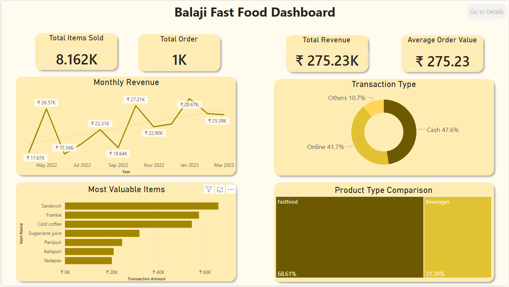

# 🍔 Fast Food Sales Dashboard

Interactive sales analytics dashboard built using Microsoft Power BI to analyze sales performance, customer transactions, and product trends in a fast food business.

This dashboard transforms raw transaction data into meaningful business insights to help understand customer behavior, revenue patterns, and product performance.

---

## 📌 Project Overview

The dashboard provides comprehensive insights into fast food sales operations, including:

- 💰 **Revenue Performance:** Tracking overall income and average order value.
- 📈 **Order Trends:** Analyzing sales activity over time (monthly revenue, time of day).
- 🏆 **Product Analysis:** Identifying best-selling items and most valuable product categories.
- 💳 **Transaction Methods:** Understanding how customers prefer to pay.
- 👥 **Customer Behavior:** Analyzing purchase distribution and buying patterns.

**Project Objective:** To practice and showcase business intelligence, data modeling, and data visualization skills through an end-to-end interactive dashboard development process.

## 🛠️ Tools & Technologies

- **Microsoft Power BI:** Data modeling, DAX measures, and interactive data visualization.
- **Core Skills:** Business Intelligence, Data Storytelling, Exploratory Data Analysis.

## 📂 Dataset Information

The dataset contains transactional sales data from a fast-food business.

- **Data Points:** Item names, quantity sold, revenue, transaction methods, order timestamps, product categories, and customer transaction data.
- **Source:** [Fast Food Sales Report](https://www.kaggle.com/datasets/rajatsurana979/fast-food-sales-report/data) (Kaggle)

---

## 📊 Dashboard Features

The project is divided into two focused views to cater to different analytical needs:

### 1. Sales Overview Dashboard
*Provides a high-level executive summary of overall business performance.*
- **Key Metrics:** Total Revenue, Total Orders, Total Items Sold, Average Order Value.
- **Key Visuals:** Monthly Revenue Trends, Most Valuable Items, Product Type Comparison, Transaction Method Distribution.

### 2. Product Detail Dashboard
*Provides deep-dive, granular analysis for specific menu items.*
- **Detailed Insights:** Item Revenue, Quantity Sold, Sales Trend Over Time.
- **Customer Analysis:** Order Quantity Distribution, Time of Sale Analysis, Customer Purchase Distribution, Transaction Type Breakdown.

---

## 📈 Key Insights

- 🥪 **Product Leader:** Sandwich products generate the highest revenue contribution among all categories.
- 💵 **Payment Preference:** Cash transactions strongly dominate the payment methods.
- 🍔 **Category Strength:** Food products contribute significantly more revenue compared to beverages.
- 🕒 **Time Dynamics:** Sales activity varies significantly depending on the time of day, highlighting specific operational peak hours.
- 📊 **Business Stability:** Monthly revenue shows typical fluctuations but indicates a generally stable business performance.

---

## 🚀 How to Use

1. Download the `.pbix` file from this repository.
2. Open the file using **Microsoft Power BI Desktop**.
3. Interact with the visuals! Use the slicers, cross-filtering, and tooltips to explore the data dynamically.