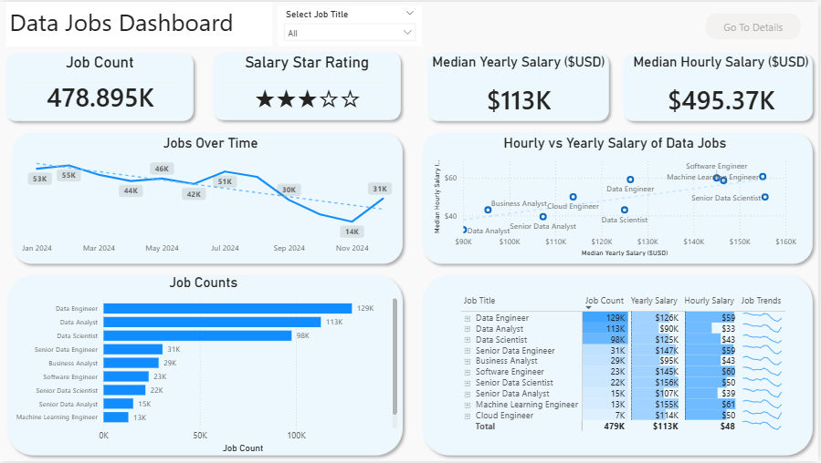

# Data Jobs Dashboard 📊

Interactive dashboard project built using Microsoft Power BI to analyze trends, salaries, and demand within the global data jobs market. This project focuses on transforming raw job posting data into meaningful business insights through data visualization and interactive reporting.

> **Inspired by the tutorial project from Luke Barousse:** [YouTube Tutorial](https://www.youtube.com/@LukeBarousse)

---

## 📌 Project Overview

The dashboard provides comprehensive insights into the current data job market, including:
- Job demand trends
- Salary comparison across roles
- Work-from-home opportunities
- Degree requirements
- Health insurance availability
- Global job distribution
- Job posting platforms

The goal of this project is to practice data analytics and dashboard development skills while delivering actionable insights from real-world datasets.

---

## 🛠️ Tools & Technologies
- **Microsoft Power BI**
- **Power Query**
- Data Cleaning & Transformation
- Data Visualization
- Interactive Dashboard Design

---

## 📂 Dataset Information
The dataset contains job posting information related to data and technology careers, including:
- Job title
- Salary information
- Job location
- Work arrangement (WFH / On-site)
- Degree requirements
- Health insurance availability
- Job platform source
- Employment schedule type

The data is used to analyze industry demand and compensation trends across multiple data-related roles.

---

## 📊 Dashboard Features

### 1. Overview Dashboard
Provides a high-level summary of the data jobs market.
- **Key Metrics:** Total Job Count, Median Yearly Salary, Median Hourly Salary, Salary Rating
- **Visualizations:** Jobs Over Time, Job Count by Role, Hourly vs Yearly Salary Comparison, Job Trend Table
- **Features:** Interactive Job Title Filter

### 2. Detailed Dashboard
Provides detailed analysis for selected job titles.
- **Detailed Insights:** Salary Distribution, Global Job Distribution Map, Work-From-Home Percentage, Degree Requirement Analysis, Health Insurance Availability, Job Platform Comparison, Employment Schedule Types

---

## 📈 Key Insights
Some insights obtained from the dashboard include:
- **Data Engineer** roles have the highest number of job postings.
- **Senior Data Scientist** and **Machine Learning Engineer** positions offer some of the highest salaries.
- Most job postings are categorized as **Full-time** positions.
- Many jobs still require **formal degree** qualifications.
- Platforms such as **LinkedIn** and **Indeed** dominate job postings in the data industry.

---

## 🎯 Project Objectives

This project was developed to:
- Improve data visualization skills using Power BI
- Practice dashboard development workflows
- Analyze real-world job market datasets
- Build a portfolio-ready data analytics project
- Generate actionable insights from data

---

## 🚀 How to Use
1. Download the `.pbix` file.
2. Open using **Microsoft Power BI**.
3. Refresh the dataset if necessary.
4. Explore the interactive dashboard.

---

## 🙌 Credits

This project is inspired by the work and tutorial content created by:
- **Luke Barousse** - [YouTube Channel](https://www.youtube.com/@LukeBarousse)